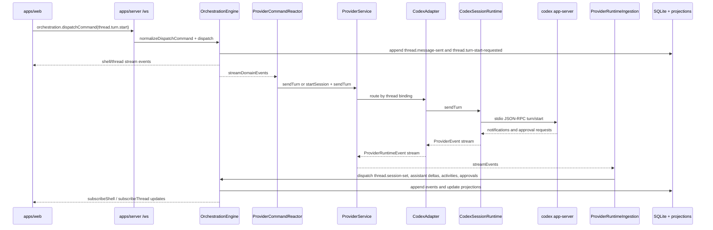

# CloudCodex Architecture Reconnaissance

Reconnaissance source: upstream T3 Code cloned from `git@github.com:pingdotgg/t3code.git` into `/tmp/t3code-upstream`.

Upstream commit inspected: `ada410bccff144ce4cfed0e2c6e18974b045f968`.

This document maps the current T3 Code architecture and identifies the smallest integration surface for `codex-remote`. It intentionally does not describe implemented feature changes.

## Repo Structure

The upstream repo is a Bun/Node TypeScript monorepo using Effect services and Effect RPC.

Important top-level paths:

- `apps/server`: the T3 server and CLI package (`package.json` name `t3`, MIT licensed).
- `apps/web`: React/Vite browser UI.
- `apps/desktop`: desktop shell that launches local T3 server and web UI.
- `apps/marketing`: marketing site.
- `packages/contracts`: shared Effect Schema contracts for HTTP/WebSocket payloads, orchestration events, auth, git, terminal, project, provider runtime, settings.
- `packages/shared`: shared helper libraries for git, model selection, path helpers, logging, drainable workers, search ranking, server settings, etc.
- `packages/effect-codex-app-server`: typed stdio JSON-RPC client for `codex app-server`.
- `packages/effect-acp`: agent client protocol support used by non-Codex providers.
- `packages/client-runtime`: environment scoping helpers used by the web client.

## Server Entrypoints

Primary server entrypoints:

- `apps/server/src/bin.ts`: CLI executable entry. Builds a runtime layer and runs `cli` through Effect CLI.
- `apps/server/src/cli.ts`: CLI flags, env config, auth-management subcommands, project commands, and `resolveServerConfig`.
- `apps/server/src/config.ts`: `ServerConfig`, default port `3773`, derived state paths, static asset lookup.
- `apps/server/src/server.ts`: server composition root. Builds HTTP server, route layers, persistence, auth, provider, git, terminal, workspace, orchestration, telemetry, and startup layers.
- `apps/server/src/serverRuntimeStartup.ts`: starts keybindings/settings/reactors, emits lifecycle events, auto-bootstraps the cwd project/thread, and opens or prints the pairing URL.

Route composition is centralized in `apps/server/src/server.ts`:

- `makeRoutesLayer`: merges auth routes, attachment route, orchestration HTTP routes, observability proxy, favicon route, environment descriptor, static/dev route, and WebSocket RPC route.
- `makeServerLayer`: launches `HttpRouter.serve(makeRoutesLayer)` with `RuntimeServicesLive`, platform HTTP server, persistence, and observability.
- `runServer`: `Layer.launch(makeServerLayer)`.

Runtime state paths are derived in `apps/server/src/config.ts`:

- Base dir defaults to `~/.t3` via `apps/server/src/os-jank.ts`.
- `stateDir`: `<baseDir>/dev` when using a dev web URL, otherwise `<baseDir>/userdata`.
- SQLite DB: `<stateDir>/state.sqlite`.
- Attachments: `<stateDir>/attachments`.
- Logs: `<stateDir>/logs`.
- Provider event log: `<stateDir>/logs/provider/events.log`.
- Secrets dir: `<stateDir>/secrets`.
- Worktrees: `<baseDir>/worktrees`.

## HTTP And WebSocket Routes

HTTP route files:

- `apps/server/src/http.ts`
  - `GET /.well-known/t3/environment`: environment descriptor, unauthenticated.
  - `GET /api/project-favicon?cwd=...`: authenticated, resolves project favicon from a cwd query parameter.
  - `GET /attachments/*`: authenticated attachment reads with path normalization.
  - `POST /api/observability/v1/traces`: authenticated browser trace ingest/proxy.
  - `GET *`: static web UI or dev redirect.
- `apps/server/src/auth/http.ts`
  - `GET /api/auth/session`
  - `POST /api/auth/bootstrap`
  - `POST /api/auth/bootstrap/bearer`
  - `POST /api/auth/ws-token`
  - `POST /api/auth/pairing-token`
  - `GET /api/auth/pairing-links`
  - `POST /api/auth/pairing-links/revoke`
  - `GET /api/auth/clients`
  - `POST /api/auth/clients/revoke`
  - `POST /api/auth/clients/revoke-others`
- `apps/server/src/orchestration/http.ts`
  - `GET /api/orchestration/snapshot`: owner-only snapshot.
  - `POST /api/orchestration/dispatch`: owner-only dispatch.
- `apps/server/src/ws.ts`
  - `GET /ws`: Effect RPC over WebSocket.

WebSocket RPC contracts live in `packages/contracts/src/rpc.ts`:

- `WS_METHODS`: server/project/filesystem/git/terminal/config/auth subscriptions.
- `ORCHESTRATION_WS_METHODS`: orchestration dispatch, diff reads, event replay, shell subscription, thread subscription.
- `WsRpcGroup`: all RPC methods bundled into a schema-backed Effect RPC group.

Browser-side RPC wiring:

- `apps/web/src/rpc/protocol.ts`: creates the WebSocket protocol layer, forces path `/ws`, and uses `WsRpcGroup`.
- `apps/web/src/rpc/wsTransport.ts`: request/subscription wrapper with reconnect behavior.
- `apps/web/src/rpc/wsRpcClient.ts`: typed client facade used by the app.
- `apps/web/src/environments/runtime/service.ts`: creates environment connections, subscribes to shell/thread streams, and syncs state.

## Auth And Pairing Behavior

T3 already has an auth layer, but it is not sufficient as-is for a hostile public cloud relay.

Relevant files:

- `packages/contracts/src/auth.ts`: auth descriptors, pairing/session schemas, auth stream events.
- `apps/server/src/auth/Layers/ServerAuthPolicy.ts`: chooses `desktop-managed-local`, `loopback-browser`, or `remote-reachable` based on mode and bind host.
- `apps/server/src/auth/Layers/BootstrapCredentialService.ts`: one-time pairing token issuance/consumption. Default one-time token TTL is 5 minutes.
- `apps/server/src/auth/Layers/SessionCredentialService.ts`: signed session tokens, browser cookie sessions, bearer sessions, and short-lived WebSocket tokens. Default session TTL is 30 days. Default WebSocket token TTL is 5 minutes.
- `apps/server/src/auth/Layers/AuthControlPlane.ts`: pairing link and session management facade.
- `apps/server/src/persistence/Migrations/020_AuthAccessManagement.ts`: `auth_pairing_links` and `auth_sessions`.
- `apps/server/src/persistence/Migrations/021_AuthSessionClientMetadata.ts`: client label/IP/user-agent/device metadata.
- `apps/server/src/persistence/Migrations/022_AuthSessionLastConnectedAt.ts`: session connection timestamps.

Important observations:

- HTTP auth accepts browser session cookie or `Authorization: Bearer ...`.
- `GET /ws` authenticates through `ServerAuth.authenticateWebSocketUpgrade`.
- Upstream T3 can use a short-lived `wsToken` query parameter for WebSocket auth. That conflicts with the `codex-remote` requirement to avoid auth tokens in query strings.
- Pairing credentials are stored in SQLite as raw `credential` text in `auth_pairing_links`, not hashes.
- Session rows store session metadata and revocation state. The bearer/cookie token is signed and verified against a server signing key, but raw pairing-token storage still needs replacement for the cloud server.
- I did not find explicit WebSocket Origin validation or route-level rate limiting in the upstream server.

For `codex-remote`, do not expose upstream T3 `/ws` directly on the VPS. Put an authenticated cloud API/WS in front, validate Origin and schemas there, and keep any local T3/Codex runtime bound to `127.0.0.1` or stdio only.

## Provider Manager

Provider composition is in `apps/server/src/server.ts`:

- `ProviderLayerLive`: creates native/canonical event loggers, builds provider adapter layers, registers adapters, and creates `ProviderService`.
- `ProviderRegistryLive`: exposes provider status snapshots.
- `ProviderAdapterRegistryLive`: maps provider kind to adapter implementation.
- `makeProviderServiceLive`: cross-provider facade.

Core provider files:

- `apps/server/src/provider/Services/ProviderService.ts`: service contract for start session, send turn, interrupt, approval response, user-input response, stop, list, rollback, and `streamEvents`.
- `apps/server/src/provider/Layers/ProviderService.ts`: validates inputs, routes to the right adapter, persists runtime bindings, logs canonical provider events, and publishes `ProviderRuntimeEvent` to subscribers.
- `apps/server/src/provider/Layers/ProviderSessionDirectory.ts`: persists provider/thread bindings through `provider_session_runtime`.
- `apps/server/src/persistence/Migrations/004_ProviderSessionRuntime.ts`: provider runtime binding table.
- `apps/server/src/provider/Layers/ProviderRegistry.ts`: provider status registry.
- `apps/server/src/provider/Layers/ProviderAdapterRegistry.ts`: adapter registry.

Provider runtime events are normalized into `ProviderRuntimeEvent` schemas in `packages/contracts/src/providerRuntime.ts`.

## Codex App-Server Manager

Codex is managed through a child process and stdio JSON-RPC. The Codex app-server is not meant to be exposed as a public network service.

Important paths:

- `packages/effect-codex-app-server/src/client.ts`
  - `layerCommand(...)`: spawns a command, usually `codex app-server`.
  - `layerChildProcess(...)`: wraps an existing child process.
  - `make(...)`: typed client over stdio.
- `packages/effect-codex-app-server/src/protocol.ts`
  - Newline-delimited JSON-RPC-ish transport over stdio.
  - Handles requests, notifications, responses, pending request map, and termination.
- `packages/effect-codex-app-server/src/_internal/stdio.ts`
  - Maps child stdout to protocol stdin and protocol stdout to child stdin.
- `apps/server/src/provider/Layers/CodexProvider.ts`
  - Probes Codex status by spawning `codex app-server`, initializing, reading account, skills, and models.
- `apps/server/src/provider/Layers/CodexSessionRuntime.ts`
  - Starts the long-lived Codex child process for a T3 thread.
  - Calls `initialize`, `initialized`, `thread/start` or `thread/resume`, `turn/start`, `turn/interrupt`, `thread/read`, `thread/rollback`.
  - Tracks pending command/file approvals and structured user-input requests in memory.
  - Emits raw provider events from app-server notifications/requests.
- `apps/server/src/provider/Layers/CodexAdapter.ts`
  - Maps raw Codex provider events to canonical `ProviderRuntimeEvent`.
  - Exposes `sendTurn`, `interruptTurn`, `respondToRequest`, `respondToUserInput`, `rollbackThread`, etc. through the provider adapter interface.

Runtime mode mapping in `CodexSessionRuntime.ts`:

- `approval-required` -> Codex approval policy `untrusted`, sandbox `read-only`.
- `auto-accept-edits` -> approval policy `on-request`, sandbox `workspace-write`.
- `full-access` -> approval policy `never`, sandbox `danger-full-access`.

For `codex-remote`, the Mac runner can initially talk to local T3 over authenticated localhost `/ws`. A deeper in-process integration can later hook at `ProviderService.streamEvents` or `OrchestrationEngineService.streamDomainEvents`, but that requires changing upstream server composition.

## Event Flow From Codex To Web UI

High-level command and event flow:

Specific flow details:

- Browser commands enter through `apps/web/src/rpc/wsRpcClient.ts` and `apps/server/src/ws.ts`.
- `apps/server/src/ws.ts` calls `normalizeDispatchCommand` from `apps/server/src/orchestration/Normalizer.ts`.
- `thread.turn.start` is decided in `apps/server/src/orchestration/decider.ts` into:
  - `thread.message-sent`
  - `thread.turn-start-requested`
- `ProviderCommandReactor` in `apps/server/src/orchestration/Layers/ProviderCommandReactor.ts` consumes `thread.turn-start-requested`, ensures a provider session, then calls `ProviderService.sendTurn`.
- `ProviderService` routes to `CodexAdapter`.
- `CodexAdapter` starts or reuses `CodexSessionRuntime`.
- `CodexSessionRuntime` owns the `codex app-server` child process and maps app-server requests/notifications into raw provider events.
- `CodexAdapter` maps raw Codex provider events into canonical `ProviderRuntimeEvent`.
- `ProviderRuntimeIngestion` in `apps/server/src/orchestration/Layers/ProviderRuntimeIngestion.ts` consumes canonical provider events and dispatches domain commands such as:
  - `thread.session.set`
  - `thread.message.assistant.delta`
  - `thread.message.assistant.complete`
  - `thread.activity.append`
  - `thread.proposed-plan.upsert`
- `OrchestrationEngine` persists resulting events and publishes domain streams.
- `apps/server/src/ws.ts` exposes:
  - `orchestration.subscribeShell`: shell snapshot plus project/thread shell updates.
  - `orchestration.subscribeThread`: thread detail snapshot plus thread events.
  - `orchestration.replayEvents`: sequence-based event replay.
- `apps/web/src/environments/runtime/service.ts` subscribes and applies snapshots/events to Zustand state in `apps/web/src/store.ts`.

## State And Database Locations

SQLite setup:

- `apps/server/src/persistence/Layers/Sqlite.ts`: creates DB directory, enables `PRAGMA journal_mode = WAL`, enables foreign keys, runs migrations.
- `apps/server/src/persistence/Migrations.ts`: static migration list.
- `apps/server/src/persistence/Migrations/001_OrchestrationEvents.ts`: append-only event table.
- `apps/server/src/persistence/Migrations/002_OrchestrationCommandReceipts.ts`: idempotency/receipt table.
- `apps/server/src/persistence/Migrations/004_ProviderSessionRuntime.ts`: provider runtime binding table.
- `apps/server/src/persistence/Migrations/005_Projections.ts`: projection tables for projects, threads, messages, activities, sessions, turns, pending approvals, projection state.

Projection and event access:

- `apps/server/src/persistence/Layers/OrchestrationEventStore.ts`: append/read event store.
- `apps/server/src/orchestration/Layers/OrchestrationEngine.ts`: queues commands, decides events, appends in transactions, updates in-memory read model, publishes domain events.
- `apps/server/src/orchestration/Layers/ProjectionPipeline.ts`: applies events to projection tables.
- `apps/server/src/orchestration/Layers/ProjectionSnapshotQuery.ts`: reads shell/thread snapshots.

Provider and native logs:

- `apps/server/src/provider/Layers/EventNdjsonLogger.ts`: writes native and canonical provider event logs when configured.
- `ServerConfig.providerEventLogPath`: `<stateDir>/logs/provider/events.log`.

## Project And Workspace Handling

Project roots are modeled in orchestration:

- `packages/contracts/src/orchestration.ts`
  - `ProjectCreateCommand.workspaceRoot`
  - `OrchestrationProject.workspaceRoot`
  - `OrchestrationThread.worktreePath`
- `apps/server/src/orchestration/Normalizer.ts`
  - Normalizes project roots with `WorkspacePaths.normalizeWorkspaceRoot`.
  - Supports `createWorkspaceRootIfMissing` for project creation.
  - Persists image attachments for `thread.turn.start`.
- `apps/server/src/serverRuntimeStartup.ts`
  - Can auto-create a project for `ServerConfig.cwd` and an initial "New thread".
- `apps/server/src/checkpointing/Utils.ts`
  - `resolveThreadWorkspaceCwd` chooses `thread.worktreePath` first, else project `workspaceRoot`.

Workspace utilities:

- `apps/server/src/workspace/Layers/WorkspacePaths.ts`
  - Expands `~`.
  - Resolves workspace roots to absolute paths.
  - Checks relative paths with `path.resolve` and `path.relative`.
- `apps/server/src/workspace/Layers/WorkspaceEntries.ts`
  - Searches project files using git when possible, else filesystem scanning.
  - Ignores `.git`, `node_modules`, build output, and similar dirs.
  - `filesystem.browse` supports arbitrary path browsing with optional `cwd`.
- `apps/server/src/workspace/Layers/WorkspaceFileSystem.ts`
  - Writes files by resolving `relativePath` inside `cwd`.

Git/worktree handling:

- `apps/server/src/git/Layers/GitCore.ts`: git status, branch, worktree, checkout, list files.
- `apps/server/src/git/Layers/GitManager.ts`: higher-level stacked git and PR workflows.
- `apps/server/src/ws.ts`: WebSocket methods call git services with client-provided `cwd`.

## Security-Sensitive Path And CWD Handling

Current upstream T3 is built primarily for a local/desktop trust boundary. The following surfaces need wrapping or hardening before public exposure:

- Many WebSocket RPC methods accept client-supplied `cwd` directly:
  - `projects.searchEntries`
  - `projects.writeFile`
  - `filesystem.browse`
  - git methods such as `git.pull`, `git.refreshStatus`, `git.createWorktree`, `git.checkout`
  - terminal methods
- `WorkspacePaths.resolveRelativePathWithinRoot` guards against simple `..` traversal, but it does not realpath every path segment. A symlink under the root could still redirect a write outside the intended workspace.
- `WorkspaceEntries.browse` can browse absolute paths and home-expanded paths. That is reasonable for a local UI but inappropriate for the public cloud API.
- `GET /api/project-favicon?cwd=...` accepts a cwd query parameter and should not be exposed as-is through a public control plane.
- `thread.worktreePath` takes precedence over project root in `resolveThreadWorkspaceCwd`. The cloud server must not trust a phone/browser-supplied worktree path.
- Provider runtime cwd is ultimately passed into `codex app-server` in `apps/server/src/provider/Layers/CodexSessionRuntime.ts`.

For `codex-remote`, the cloud server should treat project roots as server/runner-registered facts:

- Clients should address `projectId`, `threadId`, and registered file ids/relative paths, not raw cwd.
- Server must normalize and realpath roots at registration time.
- Runner must re-check realpath containment before every file or process operation.
- Cloud relay commands should map cloud project ids to runner-local workspace roots.
- Do not forward arbitrary cwd-bearing T3 RPC calls from mobile clients to the runner.

## Cloud Relay Integration Point

The lowest-risk relay point is outside upstream T3:

1. Keep local T3 server and Codex app-server private on the Mac.
2. Have `apps/mac-runner-cli` connect to local T3 on `127.0.0.1`.
3. Have `apps/mac-runner-cli` connect outbound to `apps/cloud-server` over WSS.
4. The cloud server exposes only authenticated cloud APIs and cloud WebSockets.
5. The runner translates cloud commands to local T3 RPC calls and translates local T3 stream events into cloud events.

The minimal T3-facing calls for the runner are:

- Subscribe to `orchestration.subscribeShell` for project/thread shell state.
- Subscribe to `orchestration.subscribeThread` for active thread detail.
- Use `orchestration.replayEvents` to backfill missed event sequences.
- Use `orchestration.dispatchCommand` for prompts, interrupt, approval responses, user-input responses, thread creation, and session stop.
- Use selected read-only RPCs later for diffs/status if needed: `getTurnDiff`, `getFullThreadDiff`, `subscribeGitStatus`.

This preserves upstream UI behavior because it uses the same public T3 RPC contract that `apps/web` already uses. It also avoids exposing raw Codex app-server or raw T3 `/ws` over the internet.

If a later fork wants an in-process relay, the clean internal hook points are:

- `ProviderService.streamEvents` in `apps/server/src/provider/Layers/ProviderService.ts` for canonical provider runtime events.
- `OrchestrationEngineService.streamDomainEvents` in `apps/server/src/orchestration/Layers/OrchestrationEngine.ts` for persisted domain events.
- `ProviderCommandReactor` and `ProviderRuntimeIngestion` are already the bridges between domain events and provider runtime. Do not rewrite these for v1.

## Recommended First Implementation Slice

First small diff for `codex-remote` should be Phase 1A, not a T3 fork:

- Add root monorepo scaffolding:
  - `package.json`
  - `tsconfig.base.json`
  - package manager config matching the project choice.
- Add shared protocol package:
  - `packages/protocol/package.json`
  - `packages/protocol/src/index.ts`
  - `packages/protocol/src/auth.ts`
  - `packages/protocol/src/runner.ts`
  - `packages/protocol/src/client.ts`
  - `packages/protocol/src/events.ts`
  - `packages/protocol/src/commands.ts`
- Add cloud server skeleton:
  - `apps/cloud-server/package.json`
  - `apps/cloud-server/src/index.ts`
  - `apps/cloud-server/src/config.ts`
  - `apps/cloud-server/src/db.ts`
  - `apps/cloud-server/src/http.ts`
  - `apps/cloud-server/src/ws/runner.ts`
  - `apps/cloud-server/src/ws/client.ts`
  - `apps/cloud-server/src/auth/*.ts`
  - `apps/cloud-server/test/*.test.ts`
- Include from the first slice:
  - `GET /healthz`
  - SQLite WAL setup and migrations.
  - Hashed one-time pairing tokens.
  - Hashed device/session tokens.
  - Runner registration table.
  - Event store table with per-runner/per-thread monotonically increasing sequence.
  - Authenticated runner WebSocket route.
  - Authenticated client WebSocket route.
  - Origin validation and max payload size.
  - Schema validation for every WebSocket message.
  - Basic audit log table.
- Tests for:
  - pairing expiration and single-use behavior.
  - auth token hashing and verification.
  - WebSocket auth failure.
  - event ordering/backfill.
  - path guard realpath containment helpers.

Do not import or expose upstream T3 server internals in this first slice. The cloud server should define its own security boundary and protocol, then `apps/mac-runner-cli` can adapt that protocol to local T3 RPC in Phase 2.
